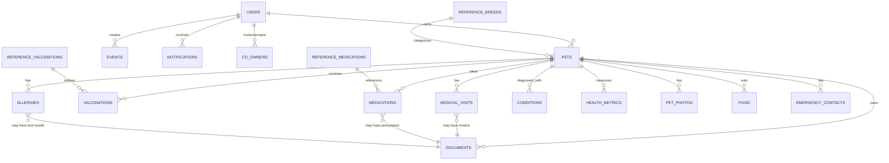

# Database Architecture - Complete Specification

**Document Version**: 1.0  
**Last Updated**: January 23, 2026  
**Status**: Complete  
**Related Documents**:
- [System Architecture Overview](./system-architecture-overview.md)
- [API Specifications](./api-specifications-complete.md)
- [Security & Compliance](./security-compliance-complete.md)

---

## Executive Summary

Waggli's database architecture centers on **PostgreSQL** (via Supabase) with **42 tables** organized into logical domains. The schema supports multi-country operations through **table partitioning**, ensures data integrity via **foreign key constraints**, and maintains security through **Row Level Security (RLS) policies**.

**Key Characteristics**:
- **Database Platform**: PostgreSQL 15+ (Supabase managed)
- **Total Tables**: 42 (35 core + 7 reference data)
- **Storage Estimate**: 500MB-5GB (Year 1), 50GB-500GB (Year 3)
- **Partitioning Strategy**: By `country_code` for large tables (users, pets)
- **Backup**: Daily automated backups, 30-day retention, Point-in-Time Recovery

---

## 1. Database Overview

### 1.1 Schema Organization

**Domain Groups**:
| Domain | Tables | Purpose |
|--------|--------|---------|
| **User & Auth** | 7 | User profiles, authentication, roles, sessions |
| **Pet Management** | 5 | Pet profiles, photos, identification, sharing |
| **Health Records** | 13 | Medical visits, vaccinations, medications, allergies, conditions |
| **Documents & Media** | 2 | File storage metadata, document management |
| **Calendar & Reminders** | 3 | Events, reminders, notifications |
| **Sharing & Collaboration** | 3 | Co-owners, public shares, link sharing |
| **Reference Data** | 7 | Breeds, vaccines, medications (lookup tables) |
| **Social & Community** | 0 | (Phase 2: posts, comments, groups) |
| **Admin & Audit** | 2 | Activity logs, audit logs |

**Total**: **42 tables**

### 1.2 Entity Relationship Diagram (High Level)



---

## 2. Core Tables (Detailed Specifications)

### 2.1 User & Authentication Domain

#### **users** (Custom auth.users extension)

Note: Supabase uses `auth.users` for authentication. We extend with `profiles` table.

#### **profiles**

**Purpose**: Extended user information beyond authentication

```sql
CREATE TABLE public.profiles (
    id UUID PRIMARY KEY REFERENCES auth.users(id) ON DELETE CASCADE,
    first_name TEXT,
    last_name TEXT,
    country_code TEXT NOT NULL,  -- For multi-country partitioning
    language_code TEXT DEFAULT 'en',
    date_of_birth DATE,
    photo_url TEXT,
    
    -- Contact
    email TEXT,  -- Denormalized from auth.users for convenience
    phone TEXT,
    address TEXT,
    location_lat DOUBLE PRECISION,
    location_lng DOUBLE PRECISION,
    place_id TEXT,  -- Google Places API ID
    
    -- Profile
    gender TEXT CHECK (gender IN ('male', 'female', 'non_binary', 'prefer_not_to_say')),
    bio TEXT,
    website TEXT,
    
    -- Settings
    notification_prefs JSONB DEFAULT '{
        "email": true,
        "push": true,
        "sms": false,
        "marketing": false
    }'::jsonb,
    
    onboarding_completed BOOLEAN DEFAULT false,
    
    created_at TIMESTAMPTZ DEFAULT NOW(),
    updated_at TIMESTAMPTZ DEFAULT NOW()
);

-- Indexes
CREATE INDEX idx_profiles_country_code ON profiles(country_code);
CREATE INDEX idx_profiles_email ON profiles(email);
CREATE INDEX idx_profiles_location ON profiles USING GIST(ll_to_earth(location_lat, location_lng));
```

**Partitioning Strategy** (for scale):
```sql
-- Partition by country for performance (Phase 2)
CREATE TABLE profiles_de PARTITION OF profiles FOR VALUES IN ('DE');
CREATE TABLE profiles_fr PARTITION OF profiles FOR VALUES IN ('FR');
CREATE TABLE profiles_nl PARTITION OF profiles FOR VALUES IN ('NL');
CREATE TABLE profiles_at PARTITION OF profiles FOR VALUES IN ('AT');
```

#### **roles**

**Purpose**: Role-based access control (RBAC)

```sql
CREATE TABLE public.roles (
    id UUID PRIMARY KEY DEFAULT gen_random_uuid(),
    name VARCHAR UNIQUE NOT NULL,  -- 'pet_owner', 'admin', 'vet_partner', 'support'
    permissions JSONB NOT NULL DEFAULT '{}'::jsonb,
    description TEXT,
    created_at TIMESTAMPTZ DEFAULT NOW()
);

-- Example permissions structure:
-- {
--   "pets": {"create": true, "read": true, "update": true, "delete": true},
--   "health_records": {"create": true, "read": true, "update": true, "delete": true},
--   "admin": {"users": false, "analytics": false}
-- }
```

#### **user_roles** (Many-to-Many)

```sql
CREATE TABLE public.user_roles (
    id UUID PRIMARY KEY DEFAULT gen_random_uuid(),
    user_id UUID NOT NULL REFERENCES auth.users(id) ON DELETE CASCADE,
    role USER-DEFINED NOT NULL,  -- Foreign key or ENUM
    created_at TIMESTAMPTZ DEFAULT NOW()
);

CREATE INDEX idx_user_roles_user_id ON user_roles(user_id);
```

---

### 2.2 Pet Management Domain

#### **pets** (Core Entity)

**Purpose**: Central pet profile with identification and passport data

```sql
CREATE TABLE public.pets (
    id UUID PRIMARY KEY DEFAULT uuid_generate_v4(),
    user_id UUID NOT NULL REFERENCES auth.users(id) ON DELETE CASCADE,
    
    -- Basic Info
    name TEXT NOT NULL,
    species TEXT NOT NULL CHECK (species IN ('dog', 'cat', 'bird', 'rabbit', 'reptile', 'other')),
    breed TEXT,  -- References reference_breeds (soft FK)
    gender TEXT CHECK (gender IN ('male', 'female')),
    
    -- Age
    date_of_birth DATE,
    age_approximate TEXT,  -- "2-3 years" if DOB unknown
    
    -- Physical
    size TEXT CHECK (size IN ('small', 'medium', 'large')),
    weight NUMERIC,  -- kg
    height NUMERIC,  -- cm
    color TEXT,
    coat_type VARCHAR,
    eye_color VARCHAR,
    distinguishing_marks TEXT,
    ears TEXT,
    tail TEXT,
    
    -- Weight Management
    ideal_weight_min NUMERIC,
    ideal_weight_max NUMERIC,
    
    -- Photos
    photo_url TEXT,  -- Main profile photo
    photo_gallery TEXT[],  -- Array of URLs
    
    -- Identification
    microchip_number TEXT UNIQUE,
    microchip_implantation_date DATE,
    microchip_date DATE,  -- Duplicate? Check if needed
    tattoo_id VARCHAR,
    registration_id TEXT,
    
    -- Health Status
    is_spayed_neutered BOOLEAN DEFAULT false,
    spayed_neutered_date DATE,
    blood_type TEXT,
    
    -- EU Pet Passport
    passport_id VARCHAR UNIQUE,  -- Unique passport ID (auto-generated)
    passport_generated_at TIMESTAMP,
    passport_updated_at TIMESTAMP,
    passport_issuer TEXT,  -- Vet clinic that issued digital passport
    passport_issue_date DATE,
    
    -- Address (if different from owner)
    address_json JSONB,  -- {street, city, postal_code, country}
    
    -- Status
    pet_status VARCHAR DEFAULT 'active' CHECK (pet_status IN ('active', 'deceased', 'adopted', 'lost')),
    
    created_at TIMESTAMPTZ DEFAULT NOW(),
    updated_at TIMESTAMPTZ DEFAULT NOW()
);

-- Indexes
CREATE INDEX idx_pets_user_id ON pets(user_id);
CREATE INDEX idx_pets_species ON pets(species);
CREATE INDEX idx_pets_microchip ON pets(microchip_number) WHERE microchip_number IS NOT NULL;
CREATE INDEX idx_pets_passport_id ON pets(passport_id) WHERE passport_id IS NOT NULL;
CREATE INDEX idx_pets_status ON pets(pet_status);

-- Full-text search on pet names and breeds
CREATE INDEX idx_pets_search ON pets USING GIN(to_tsvector('english', name || ' ' || COALESCE(breed, '')));
```

**Data Example**:
```json
{
  "id": "550e8400-e29b-41d4-a716-446655440000",
  "user_id": "123e4567-e89b-12d3-a456-426614174000",
  "name": "Bella",
  "species": "dog",
  "breed": "Golden Retriever",
  "gender": "female",
  "date_of_birth": "2020-03-15",
  "weight": 32.5,
  "microchip_number": "981098106234567",
  "passport_id": "NL-2024-001234",
  "is_spayed_neutered": true,
  "pet_status": "active"
}
```

---

#### **pet_photos**

**Purpose**: Gallery of pet photos with metadata

```sql
CREATE TABLE public.pet_photos (
    id UUID PRIMARY KEY DEFAULT uuid_generate_v4(),
    pet_id UUID NOT NULL REFERENCES pets(id) ON DELETE CASCADE,
    user_id UUID NOT NULL REFERENCES auth.users(id),  -- Who uploaded
    url TEXT NOT NULL,  -- Supabase Storage URL
    caption TEXT,
    is_favorite BOOLEAN DEFAULT false,
    created_at TIMESTAMPTZ DEFAULT NOW()
);

CREATE INDEX idx_pet_photos_pet_id ON pet_photos(pet_id);
CREATE INDEX idx_pet_photos_user_id ON pet_photos(user_id);
```

---

#### **reference_breeds** (Lookup Table)

**Purpose**: Standardized breed database for autocomplete and data consistency

```sql
CREATE TABLE public.reference_breeds (
    id UUID PRIMARY KEY DEFAULT gen_random_uuid(),
    species TEXT NOT NULL CHECK (species IN ('dog', 'cat')),
    name TEXT NOT NULL,  -- e.g., "Golden Retriever"
    metadata JSONB,  -- {size_category, temperament, lifespan_avg, etc.}
    created_at TIMESTAMPTZ DEFAULT NOW()
);

CREATE UNIQUE INDEX idx_reference_breeds_unique ON reference_breeds(species, name);
CREATE INDEX idx_reference_breeds_species ON reference_breeds(species);

-- Example data
INSERT INTO reference_breeds (species, name, metadata) VALUES
('dog', 'Golden Retriever', '{"size": "large", "lifespan": "10-12", "temperament": "friendly, intelligent"}'),
('dog', 'German Shepherd', '{"size": "large", "lifespan": "9-13", "temperament": "confident, courageous"}'),
('cat', 'Siamese', '{"size": "medium", "lifespan": "12-15", "temperament": "vocal, affectionate"}');
```

**Data Source**: CSV files in `/waggly/documents/breed-data/`

---

### 2.3 Health Records Domain

#### **medical_visits**

**Purpose**: Veterinary visit records with provider details and Google Places integration

```sql
CREATE TABLE public.medical_visits (
    id UUID PRIMARY KEY DEFAULT gen_random_uuid(),
    pet_id UUID NOT NULL REFERENCES pets(id) ON DELETE CASCADE,
    
    -- Visit Details
    date DATE NOT NULL,
    visit_time TIME,
    duration_minutes INT,
    
    -- Provider (Manual or from Google Places)
    provider_type VARCHAR DEFAULT 'veterinary' CHECK (provider_type IN ('veterinary', 'specialist', 'emergency', 'dental', 'grooming')),
    provider_name VARCHAR,  -- Vet's name
    business_name VARCHAR,  -- Clinic name
    business_phone VARCHAR,
    business_email VARCHAR,
    business_website VARCHAR,
    
    -- Location (Google Places API)
    clinic_name TEXT,  -- Deprecated: use business_name
    vet_name TEXT,     -- Deprecated: use provider_name
    business_place_id VARCHAR,  -- Google Places ID
    business_lat NUMERIC,
    business_lng NUMERIC,
    distance_km NUMERIC,  -- Distance from owner's location
    
    -- Visit Information
    reason TEXT NOT NULL,
    service_category VARCHAR,  -- 'wellness', 'illness', 'surgery', 'follow-up'
    diagnosis TEXT,
    recommendations JSONB,  -- Array of recommendations from vet
    special_instructions TEXT,
    current_medications JSONB,  -- Medications prescribed during visit
    notes TEXT,
    
    -- Cost
    cost NUMERIC,
    currency TEXT DEFAULT 'EUR',
    cost_breakdown JSONB,  -- {consultation: 50, lab_work: 100, medications: 30}
    payment_method VARCHAR,
    
    -- Insurance
    insurance_provider VARCHAR,
    insurance_claim_status VARCHAR CHECK (insurance_claim_status IN ('not_filed', 'pending', 'approved', 'denied')),
    
    -- Documents
    invoice_document_id UUID REFERENCES documents(id),
    attachments JSONB,  -- Array of document IDs
    
    -- Reminders
    reminder_enabled BOOLEAN DEFAULT false,
    reminder_date TIMESTAMP,
    reminder_type VARCHAR,
    
    -- Sharing
    shared_with JSONB,  -- User IDs or 'vet_clinic' for clinic access
    
    created_at TIMESTAMPTZ DEFAULT timezone('utc', NOW()),
    updated_at TIMESTAMPTZ DEFAULT timezone('utc', NOW())
);

CREATE INDEX idx_medical_visits_pet_id ON medical_visits(pet_id);
CREATE INDEX idx_medical_visits_date ON medical_visits(date DESC);
CREATE INDEX idx_medical_visits_place_id ON medical_visits(business_place_id) WHERE business_place_id IS NOT NULL;
```

---

#### **vaccinations**

**Purpose**: Vaccination records with batch tracking and due date calculation

```sql
CREATE TABLE public.vaccinations (
    id UUID PRIMARY KEY DEFAULT uuid_generate_v4(),
    pet_id UUID NOT NULL REFERENCES pets(id) ON DELETE CASCADE,
    
    -- Vaccine Details
    vaccine_name TEXT NOT NULL,  -- "Rabies", "DHPP", "FVRCP"
    vaccine_type TEXT,  -- References ref_vaccines (soft FK)
    batch_number TEXT,  -- Manufacturer batch/lot number
    manufacturer TEXT,
    
    -- Administration
    date_administered DATE NOT NULL,
    administered_by TEXT,  -- Vet name
    clinic_name TEXT,
    
    -- Next Due
    next_due_date DATE,  -- Auto-calculated or manually set
    validity_months INT,  -- 12, 36 for rabies, etc.
    
    -- Status
    status TEXT DEFAULT 'valid' CHECK (status IN ('valid', 'expired', 'upcoming', 'overdue')),
    
    -- Documents
    certificate_document_id UUID REFERENCES documents(id),
    
    -- Notes
    notes TEXT,
    side_effects TEXT,
    
    created_at TIMESTAMPTZ DEFAULT NOW(),
    updated_at TIMESTAMPTZ DEFAULT NOW()
);

CREATE INDEX idx_vaccinations_pet_id ON vaccinations(pet_id);
CREATE INDEX idx_vaccinations_date ON vaccinations(date_administered DESC);
CREATE INDEX idx_vaccinations_next_due ON vaccinations(next_due_date);
CREATE INDEX idx_vaccinations_status ON vaccinations(status);

-- Auto-update status trigger
CREATE OR REPLACE FUNCTION update_vaccination_status()
RETURNS TRIGGER AS $$
BEGIN
    IF NEW.next_due_date < CURRENT_DATE THEN
        NEW.status := 'overdue';
    ELSIF NEW.next_due_date < CURRENT_DATE + INTERVAL '30 days' THEN
        NEW.status := 'upcoming';
    ELSE
        NEW.status := 'valid';
    END IF;
    RETURN NEW;
END;
$$ LANGUAGE plpgsql;

CREATE TRIGGER vaccination_status_update
    BEFORE INSERT OR UPDATE ON vaccinations
    FOR EACH ROW
    EXECUTE FUNCTION update_vaccination_status();
```

---

#### **medications**

**Purpose**: Comprehensive medication tracking with reminders and refill management

```sql
CREATE TABLE public.medications (
    id UUID PRIMARY KEY DEFAULT gen_random_uuid(),
    pet_id UUID NOT NULL REFERENCES pets(id) ON DELETE CASCADE,
    
    -- Medication Details
    name TEXT NOT NULL,
    treatment_type VARCHAR,  -- 'medication', 'supplement', 'injection', 'topical'
    strength VARCHAR,  -- "250mg", "5ml"
    form VARCHAR,  -- 'tablet', 'liquid', 'injection', 'topical'
    
    -- Dosage
    dosage_value NUMERIC,
    dosage_unit TEXT,  -- 'mg', 'ml', 'tablets'
    frequency TEXT,  -- 'OD', 'BID', 'TID', 'QID', 'PRN'
    administration_times JSONB,  -- ["08:00", "20:00"] for BID
    administration_instructions TEXT,
    best_time_to_give JSONB,  -- {with_food: true, morning: true}
    
    -- Duration
    start_date DATE,
    end_date DATE,
    duration_value INT,
    duration_unit VARCHAR,  -- 'days', 'weeks', 'months'
    is_ongoing BOOLEAN DEFAULT false,  -- Chronic medication
    
    -- Prescription
    prescribed_by VARCHAR,  -- Vet name
    pharmacy_name VARCHAR,
    pharmacy_place_id VARCHAR,  -- Google Places ID
    prescription_number VARCHAR,
    prescription_document_id UUID REFERENCES documents(id),
    
    -- Refills
    refill_schedule JSONB,  -- {interval_days: 30, last_refill: '2024-01-15'}
    auto_refill BOOLEAN DEFAULT false,
    
    -- Cost
    unit_price NUMERIC,
    quantity INT,
    total_cost NUMERIC,
    currency TEXT DEFAULT 'USD',
    insurance_coverage_percent INT,
    out_of_pocket_cost NUMERIC,
    
    -- Safety
    side_effects JSONB,  -- ["drowsiness", "vomiting"]
    severity_rating VARCHAR,
    contraindications TEXT,
    interactions JSONB,  -- Other medications that interact
    storage_instructions VARCHAR,
    
    -- Clinical
    reason_for_treatment TEXT,
    condition_being_treated VARCHAR,
    monitor_for JSONB,  -- Symptoms/vitals to monitor
    
    -- Reminders
    reminders_enabled BOOLEAN DEFAULT false,
    reminder_notify_caregivers JSONB,  -- User IDs to notify
    reminder_before_minutes INT DEFAULT 30,
    reminder_calendar_event BOOLEAN DEFAULT false,
    
    -- Attachments
    attachments TEXT[],
    notes TEXT,
    
    created_at TIMESTAMPTZ DEFAULT NOW(),
    updated_at TIMESTAMPTZ DEFAULT NOW()
);

CREATE INDEX idx_medications_pet_id ON medications(pet_id);
CREATE INDEX idx_medications_dates ON medications(start_date, end_date);
CREATE INDEX idx_medications_ongoing ON medications(is_ongoing) WHERE is_ongoing = true;
```

---

#### **allergies**

**Purpose**: Allergy tracking with severity, triggers, and emergency plans

```sql
CREATE TABLE public.allergies (
    id UUID PRIMARY KEY DEFAULT uuid_generate_v4(),
    pet_id UUID NOT NULL REFERENCES pets(id) ON DELETE CASCADE,
    
    -- Allergy Classification
    type TEXT NOT NULL CHECK (type IN ('food', 'environment', 'medication')),
    allergy_type VARCHAR,  -- More specific: 'seasonal', 'year-round'
    allergen TEXT NOT NULL,  -- "Chicken", "Pollen", "Penicillin"
    
    -- Severity
    severity_level VARCHAR CHECK (severity_level IN ('mild', 'moderate', 'severe', 'anaphylaxis')),
    quality_of_life_impact INT CHECK (quality_of_life_impact BETWEEN 1 AND 10),
    
    -- Symptoms
    symptoms JSONB,  -- ["itching", "vomiting", "hives"]
    symptom_onset VARCHAR,  -- "immediate", "within hours", "delayed"
    reaction_description TEXT,
    reaction_timeline TEXT,
    
    -- Triggers & Patterns
    triggers JSONB,  -- Environmental factors that worsen reaction
    seasonal_pattern JSONB,  -- {spring: true, summer: false, ...}
    peak_months VARCHAR,
    
    -- Management
    avoidance_measures JSONB,  -- Steps taken to avoid allergen
    safe_alternatives JSONB,  -- Safe food/product alternatives
    current_treatment JSONB,  -- Medications/therapies used
    emergency_medications JSONB,  -- Epi-pen equivalent
    treatment_effectiveness VARCHAR,
    
    -- Diagnosis
    diagnosed_by VARCHAR,  -- Vet name
    diagnosed_date DATE,
    diagnostic_test VARCHAR,  -- "Blood test", "Elimination diet"
    test_results_document_id UUID REFERENCES documents(id),
    
    -- Emergency
    emergency_contact_plan JSONB,  -- Who to call, what to do
    allergy_alert_enabled BOOLEAN DEFAULT true,  -- Show prominently
    
    -- Veterinary Awareness
    vaccination_considerations TEXT,  -- Special vaccine precautions
    vet_aware BOOLEAN DEFAULT false,  -- Vet clinic has been notified
    shared_with_vets JSONB,  -- Clinic IDs that have access
    
    -- Reminders
    reminder_enabled BOOLEAN DEFAULT false,
    reminder_type VARCHAR,
    
    notes TEXT,
    created_at TIMESTAMPTZ DEFAULT NOW(),
    updated_at TIMESTAMPTZ DEFAULT NOW()
);

CREATE INDEX idx_allergies_pet_id ON allergies(pet_id);
CREATE INDEX idx_allergies_severity ON allergies(severity_level);
CREATE INDEX idx_allergies_type ON allergies(type);
```

---

#### **conditions** (Chronic/Acute Health Conditions)

```sql
CREATE TABLE public.conditions (
    id UUID PRIMARY KEY DEFAULT uuid_generate_v4(),
    pet_id UUID NOT NULL REFERENCES pets(id) ON DELETE CASCADE,
    
    name TEXT NOT NULL,  -- "Arthritis", "Diabetes", "Heart Murmur"
    status TEXT DEFAULT 'active' CHECK (status IN ('active', 'resolved', 'recurring')),
    severity TEXT CHECK (severity IN ('mild', 'moderate', 'severe')),
    
    -- Dates
    diagnosed_date DATE,
    resolved_date DATE,
    
    -- Management
    treatment_plan TEXT,
    notes TEXT,
    
    created_at TIMESTAMPTZ DEFAULT NOW(),
    updated_at TIMESTAMPTZ DEFAULT NOW()
);

CREATE INDEX idx_conditions_pet_id ON conditions(pet_id);
CREATE INDEX idx_conditions_status ON conditions(status);
```

---

### 2.4 Documents & Media

#### **documents**

**Purpose**: File metadata for all uploaded documents (prescriptions, invoices, certificates)

```sql
CREATE TABLE public.documents (
    id UUID PRIMARY KEY DEFAULT gen_random_uuid(),
    pet_id UUID NOT NULL REFERENCES pets(id) ON DELETE CASCADE,
    
    -- File Info
    type TEXT NOT NULL CHECK (type IN (
        'passport', 'certificate', 'prescription', 'lab_result', 
        'invoice', 'insurance', 'microchip_registration', 'other'
    )),
    file_url TEXT NOT NULL,  -- Supabase Storage path
    file_name TEXT NOT NULL,
    mime_type TEXT,
    size_bytes BIGINT,
    
    -- OCR & Processing
    ocr_data JSONB,  -- Extracted text from OCR
    ocr_confidence_score INT CHECK (ocr_confidence_score BETWEEN 0 AND 100),
    manual_details JSONB,  -- User corrections to OCR
    
    -- Metadata
    title VARCHAR,
    document_source VARCHAR,  -- 'upload', 'email', 'vet_portal'
    document_date DATE,  -- Date OF document (not upload date)
    document_range_start DATE,  -- For multi-date documents
    document_range_end DATE,
    tags JSONB,  -- User-added tags
    
    -- Linking
    linked_records JSONB,  -- {visit_id: "uuid", medication_id: "uuid"}
    
    -- Sharing & Privacy
    visibility VARCHAR DEFAULT 'private' CHECK (visibility IN ('private', 'shared', 'public')),
    shared_with_users JSONB,  -- User IDs
    shared_with_vets JSONB,  -- Clinic/vet IDs
    notify_recipients BOOLEAN DEFAULT false,
    confidentiality_level VARCHAR DEFAULT 'normal',
    
    -- Archiving
    archived BOOLEAN DEFAULT false,
    auto_archive_date DATE,
    
    notes TEXT,
    metadata JSONB DEFAULT '{}'::jsonb,
    
    created_at TIMESTAMPTZ DEFAULT timezone('utc', NOW()),
    updated_at TIMESTAMPTZ DEFAULT timezone('utc', NOW())
);

CREATE INDEX idx_documents_pet_id ON documents(pet_id);
CREATE INDEX idx_documents_type ON documents(type);
CREATE INDEX idx_documents_date ON documents(document_date DESC);
CREATE INDEX idx_documents_archived ON documents(archived);

-- Full-text search on OCR data
CREATE INDEX idx_documents_ocr_search ON documents USING GIN(to_tsvector('english', COALESCE(ocr_data::text, '')));
```

---

### 2.5 Calendar & Reminders

#### **events**

**Purpose**: Calendar events for vet appointments, grooming, etc.

```sql
CREATE TABLE public.events (
    id UUID PRIMARY KEY DEFAULT uuid_generate_v4(),
    user_id UUID NOT NULL REFERENCES auth.users(id) ON DELETE CASCADE,
    pet_id UUID REFERENCES pets(id) ON DELETE CASCADE,  -- Nullable for multi-pet events
    
    title TEXT NOT NULL,
    description TEXT,
    type TEXT CHECK (type IN ('vet', 'grooming', 'walking', 'boarding', 'training', 'other')),
    
    -- Time
    start_time TIMESTAMPTZ NOT NULL,
    end_time TIMESTAMPTZ,
    
    -- Location
    location TEXT,
    location_lat DOUBLE PRECISION,
    location_lng DOUBLE PRECISION,
    place_id TEXT,  -- Google Places ID
    location_place_id TEXT,  -- Duplicate?
    
    -- Cost
    cost NUMERIC,
    currency TEXT DEFAULT 'EUR',
    
    created_at TIMESTAMPTZ DEFAULT NOW(),
    updated_at TIMESTAMPTZ DEFAULT NOW()
);

CREATE INDEX idx_events_user_id ON events(user_id);
CREATE INDEX idx_events_pet_id ON events(pet_id);
CREATE INDEX idx_events_start_time ON events(start_time);
CREATE INDEX idx_events_type ON events(type);
```

---

#### **reminders**

**Purpose**: Generic reminders (medication, vaccination, checkup)

```sql
CREATE TABLE public.reminders (
    id UUID PRIMARY KEY DEFAULT uuid_generate_v4(),
    user_id UUID NOT NULL REFERENCES auth.users(id) ON DELETE CASCADE,
    pet_id UUID REFERENCES pets(id) ON DELETE CASCADE,
    
    title TEXT NOT NULL,
    date TIMESTAMPTZ NOT NULL,
    type TEXT,  -- 'medication', 'vaccination', 'checkup', 'custom'
    status TEXT DEFAULT 'pending' CHECK (status IN ('pending', 'completed', 'dismissed')),
    
    created_at TIMESTAMPTZ DEFAULT NOW(),
    updated_at TIMESTAMPTZ DEFAULT NOW()
);

CREATE INDEX idx_reminders_user_id ON reminders(user_id);
CREATE INDEX idx_reminders_pet_id ON reminders(pet_id);
CREATE INDEX idx_reminders_date ON reminders(date);
CREATE INDEX idx_reminders_status ON reminders(status);
```

---

### 2.6 Sharing & Collaboration

#### **co_owners**

**Purpose**: Multi-user pet management (families, couples)

```sql
CREATE TABLE public.co_owners (
    id UUID PRIMARY KEY DEFAULT uuid_generate_v4(),
    main_owner_id UUID NOT NULL REFERENCES auth.users(id) ON DELETE CASCADE,
    co_owner_id UUID REFERENCES auth.users(id),  -- NULL until accepted
    co_owner_email TEXT NOT NULL,
    
    status TEXT NOT NULL CHECK (status IN ('pending', 'accepted', 'requested', 'declined')),
    role TEXT DEFAULT 'co-owner' CHECK (role IN ('owner', 'co-owner', 'viewer')),
    
    permissions JSONB DEFAULT '{
        "scope": "all",
        "pet_ids": [],
        "access_level": "editor"
    }'::jsonb,
    
    created_by UUID REFERENCES auth.users(id),
    valid_until TIMESTAMPTZ,
    invite_token TEXT UNIQUE,
    
    created_at TIMESTAMPTZ DEFAULT NOW(),
    updated_at TIMESTAMPTZ DEFAULT NOW()
);

CREATE INDEX idx_co_owners_main_owner ON co_owners(main_owner_id);
CREATE INDEX idx_co_owners_co_owner ON co_owners(co_owner_id);
CREATE INDEX idx_co_owners_status ON co_owners(status);
CREATE INDEX idx_co_owners_token ON co_owners(invite_token) WHERE invite_token IS NOT NULL;
```

---

#### **pet_share_tokens** (Public Link Sharing)

```sql
CREATE TABLE public.pet_share_tokens (
    id UUID PRIMARY KEY DEFAULT uuid_generate_v4(),
    pet_id UUID NOT NULL REFERENCES pets(id) ON DELETE CASCADE,
    token TEXT NOT NULL UNIQUE,
    
    permission_level TEXT NOT NULL CHECK (permission_level IN ('basic', 'advanced')),
    -- basic: ID, photo only
    -- advanced: Full health passport
    
    is_active BOOLEAN DEFAULT true,
    expires_at TIMESTAMPTZ,
    
    accessed_count INT DEFAULT 0,
    last_accessed_at TIMESTAMPTZ,
    
    created_at TIMESTAMPTZ DEFAULT NOW()
);

CREATE INDEX idx_pet_share_tokens_pet_id ON pet_share_tokens(pet_id);
CREATE INDEX idx_pet_share_tokens_token ON pet_share_tokens(token);
CREATE INDEX idx_pet_share_tokens_active ON pet_share_tokens(is_active) WHERE is_active = true;
```

---

## 3. Reference Data Tables (Lookups)

### **reference_vaccinations**

```sql
CREATE TABLE public.reference_vaccinations (
    id UUID PRIMARY KEY DEFAULT uuid_generate_v4(),
    species TEXT NOT NULL CHECK (species IN ('dog', 'cat')),
    name TEXT NOT NULL,  -- "Rabies", "DHPP", "FVRCP"
    category TEXT NOT NULL CHECK (category IN ('core', 'non-core')),
    validity_months INT DEFAULT 12,
    description TEXT
);

-- Pre-populated data from ref_vaccines CSV
```

### **reference_medications**

```sql
CREATE TABLE public.ref_medications (
    id UUID PRIMARY KEY DEFAULT gen_random_uuid(),
    medication_name VARCHAR NOT NULL,
    brand_names JSONB,  -- ["Apoquel", "Oclacitinib"]
    active_ingredient VARCHAR,
    category VARCHAR,  -- 'antibiotic', 'anti-inflammatory', 'pain_relief'
    typical_dosage_range VARCHAR,
    common_uses TEXT,
    side_effects JSONB,
    contraindications TEXT,
    created_at TIMESTAMP DEFAULT NOW(),
    updated_at TIMESTAMP DEFAULT NOW()
);
```

---

## 4. Row Level Security (RLS) Policies

**Principle**: Users can only access data they own or have been explicitly granted access to.

### Example RLS Policies

#### **Pets Table**

```sql
-- Enable RLS
ALTER TABLE pets ENABLE ROW LEVEL SECURITY;

-- Policy: Users can view own pets
CREATE POLICY "Users can view own pets"
    ON pets FOR SELECT
    USING (auth.uid() = user_id);

-- Policy: Co-owners can view shared pets
CREATE POLICY "Co-owners can view shared pets"
    ON pets FOR SELECT
    USING (
        auth.uid() IN (
            SELECT co_owner_id FROM co_owners
            WHERE status = 'accepted'
              AND (
                  permissions->>'scope' = 'all'
                  OR id = ANY((permissions->'pet_ids')::uuid[])
              )
        )
    );

-- Policy: Users can update own pets
CREATE POLICY "Users can update own pets"
    ON pets FOR UPDATE
    USING (auth.uid() = user_id);

-- Policy: Co-owners with editor role can update
CREATE POLICY "Co-owners can update shared pets"
    ON pets FOR UPDATE
    USING (
        auth.uid() IN (
            SELECT co_owner_id FROM co_owners
            WHERE status = 'accepted'
              AND permissions->>'access_level' = 'editor'
              AND (
                  permissions->>'scope' = 'all'
                  OR id = ANY((permissions->'pet_ids')::uuid[])
              )
        )
    );

-- Policy: Users can insert own pets
CREATE POLICY "Users can insert own pets"
    ON pets FOR INSERT
    WITH CHECK (auth.uid() = user_id);
```

#### **Medical Visits Table**

```sql
ALTER TABLE medical_visits ENABLE ROW LEVEL SECURITY;

-- Users can view visits for their pets
CREATE POLICY "Users can view own pet visits"
    ON medical_visits FOR SELECT
    USING (
        pet_id IN (
            SELECT id FROM pets WHERE user_id = auth.uid()
        )
    );

-- Co-owners can view visits for shared pets
CREATE POLICY "Co-owners can view shared pet visits"
    ON medical_visits FOR SELECT
    USING (
        pet_id IN (
            SELECT p.id FROM pets p
            JOIN co_owners co ON co.status = 'accepted'
            WHERE co.co_owner_id = auth.uid()
              AND (co.permissions->>'scope' = 'all' OR p.id = ANY((co.permissions->'pet_ids')::uuid[]))
        )
    );
```

---

## 5. Indexes & Performance Optimization

### Indexing Strategy

**Primary Indexes** (Already created with PRIMARY KEY and FOREIGN KEY):
- All `id` columns (UUID primary keys)
- All foreign key columns (automatic in PostgreSQL)

**Query-Specific Indexes**:

```sql
-- Pet profile queries
CREATE INDEX idx_pets_user_species ON pets(user_id, species);
CREATE INDEX idx_pets_breed_species ON pets(breed, species) WHERE breed IS NOT NULL;

-- Health record date range queries
CREATE INDEX idx_vaccinations_pet_date_range ON vaccinations(pet_id, date_administered, next_due_date);
CREATE INDEX idx_medications_pet_active ON medications(pet_id, start_date, end_date) WHERE is_ongoing = false;

-- Document searches
CREATE INDEX idx_documents_pet_type_date ON documents(pet_id, type, document_date DESC);

-- Event calendar queries
CREATE INDEX idx_events_user_daterange ON events(user_id, start_time) WHERE start_time > NOW();

-- Co-owner lookups
CREATE INDEX idx_co_owners_email_status ON co_owners(co_owner_email, status);
```

### Partial Indexes (for common filters)

```sql
-- Only index active pets
CREATE INDEX idx_pets_active ON pets(user_id) WHERE pet_status = 'active';

-- Only index non-archived documents
CREATE INDEX idx_documents_active ON documents(pet_id, type) WHERE archived = false;

-- Only index pending reminders
CREATE INDEX idx_reminders_pending ON reminders(user_id, date) WHERE status = 'pending';
```

---

## 6. Triggers & Automated Functions

### Auto-Update `updated_at` Timestamp

```sql
CREATE OR REPLACE FUNCTION update_updated_at_column()
RETURNS TRIGGER AS $$
BEGIN
    NEW.updated_at = NOW();
    RETURN NEW;
END;
$$ LANGUAGE plpgsql;

-- Apply to all relevant tables
CREATE TRIGGER update_pets_updated_at BEFORE UPDATE ON pets
    FOR EACH ROW EXECUTE FUNCTION update_updated_at_column();

CREATE TRIGGER update_profiles_updated_at BEFORE UPDATE ON profiles
    FOR EACH ROW EXECUTE FUNCTION update_updated_at_column();

-- Repeat for medical_visits, vaccinations, medications, etc.
```

### Auto-Generate Passport ID

```sql
CREATE OR REPLACE FUNCTION generate_passport_id()
RETURNS TRIGGER AS $$
BEGIN
    IF NEW.passport_id IS NULL THEN
        NEW.passport_id := (
            SELECT UPPER(profiles.country_code) || '-' || 
                   TO_CHAR(NOW(), 'YYYY') || '-' || 
                   LPAD(NEXTVAL('passport_id_seq')::TEXT, 6, '0')
            FROM profiles
            WHERE profiles.id = NEW.user_id
        );
        NEW.passport_generated_at := NOW();
    END IF;
    RETURN NEW;
END;
$$ LANGUAGE plpgsql;

CREATE SEQUENCE passport_id_seq START 1;

CREATE TRIGGER generate_pet_passport BEFORE INSERT ON pets
    FOR EACH ROW EXECUTE FUNCTION generate_passport_id();
```

---

## 7. Data Retention & Archiving

### Archiving Strategy

**Soft Delete** (preferred for audit trail):
- Add `archived` or `deleted_at` column
- Filter queries with `WHERE archived = false`
- Periodic cleanup job moves to archive tables

**Example**:
```sql
-- Archive old documents after 5 years
UPDATE documents
SET archived = true, auto_archive_date = CURRENT_DATE
WHERE document_date < NOW() - INTERVAL '5 years'
  AND archived = false
  AND type NOT IN ('passport', 'certificate');  -- Keep important docs
```

### Backup Schedule

- **Daily Backups**: Automated via Supabase (30-day retention)
- **Weekly Full Backups**: Exported to AWS S3 glacier (1-year retention)
- **Pre-Migration Snapshots**: Manual snapshots before schema changes

---

## 8. Estimated Database Sizes

| Phase | Users | Pets | Visits | Documents | Total DB Size | Notes |
|-------|-------|------|--------|-----------|---------------|-------|
| **MVP (Month 3)** | 5K | 7K | 10K | 15K | 500MB | Minimal data |
| **Year 1** | 50K | 70K | 150K | 200K | 5GB | Early growth |
| **Year 2** | 250K | 350K | 1M | 1.5M | 50GB | Read replicas needed |
| **Year 3** | 1M | 1.4M | 5M | 8M | 500GB | Partitioning essential |

**Storage Breakdown**:
- **Structured data** (tables): 20% of total
- **File storage** (Supabase Storage): 80% of total (documents, photos)

---

## 9. Migration Strategy

### Schema Versioning

Use **Supabase Migrations** (SQL files with timestamp prefixes):

```bash
supabase/migrations/
  20260101000001_initial_schema.sql
  20260115120000_add_co_owners.sql
  20260201093000_add_ocr_fields_documents.sql
```

### Migration Best Practices

1. **Always add, never delete columns** (for backward compatibility)
2. **Use `ALTER TABLE ADD COLUMN ... DEFAULT ...`** to avoid locking
3. **Test migrations on staging** before production
4. **Create rollback scripts** for every migration
5. **Apply RLS policies immediately** after table creation

### Example Migration

```sql
-- Migration: Add health score tracking
-- Date: 2026-01-23

-- Add health_scores table
CREATE TABLE public.health_scores (
    id UUID PRIMARY KEY DEFAULT uuid_generate_v4(),
    pet_id UUID NOT NULL REFERENCES pets(id) ON DELETE CASCADE,
    calculated_date TIMESTAMP NOT NULL DEFAULT NOW(),
    overall_score INT CHECK (overall_score BETWEEN 0 AND 100),
    score_category VARCHAR,  -- 'excellent', 'good', 'fair', 'needs_attention'
    
    -- Component scores
    preventive_care_score INT,
    vaccination_score INT,
    weight_management_score INT,
    data_completeness_percentage INT,
    
    created_at TIMESTAMP DEFAULT NOW(),
    updated_at TIMESTAMP DEFAULT NOW()
);

CREATE INDEX idx_health_scores_pet_id ON health_scores(pet_id);
CREATE INDEX idx_health_scores_date ON health_scores(calculated_date DESC);

-- Enable RLS
ALTER TABLE health_scores ENABLE ROW LEVEL SECURITY;

CREATE POLICY "Users can view own pet health scores"
    ON health_scores FOR SELECT
    USING (pet_id IN (SELECT id FROM pets WHERE user_id = auth.uid()));
```

---

## Appendix: Quick Reference

**Total Tables**: 42  
**Total Indexes**: ~80 (estimated with partial indexes)  
**Total RLS Policies**: ~50 (all tables with user data)  
**Total Triggers**: ~15 (updated_at, status updates, auto-generation)

**Key Relationships**:
- 1 User → Many Pets
- 1 Pet → Many (Visits, Vaccinations, Medications, Documents)
- Many-to-Many: Users ↔ Pets (via co_owners)

**Performance Targets**:
- Query response time (p95): <50ms for indexed queries
- Full-text search: <200ms
- Complex aggregations: <500ms

---

**Document Changelog**:
- v1.0 (2026-01-23): Initial comprehensive database architecture specification

**Next Review**: After first production deployment (validate schema against real usage patterns)
