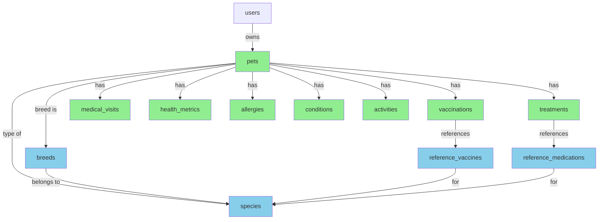

# Waggly Database Architecture - Comprehensive Review & Improvement Plan

> **Project**: PAWAG (Supabase Project: `zcskkzeguyirfliebjqg`)  
> **Review Date**: January 28, 2026  
> **Severity**: 🔴 CRITICAL - Immediate Action Required  
> **Scope**: Complete database restructure and optimization

---

## 🎯 Executive Summary

This comprehensive review identifies **critical architectural flaws** in the Waggly database that violate data normalization principles, create security vulnerabilities, and cause performance issues. The primary issue is **redundant `owner_id` fields** in child tables that should derive ownership through the `pets` relationship.

### Critical Statistics
- **34+ tables** in production database
- **15+ tables** with redundant `owner_id` fields (violates 3NF)
- **100+ unindexed foreign keys** causing performance degradation
- **Multiple duplicate indexes** wasting storage
- **2 critical security errors** (RLS not enabled despite policies)
- **Inconsistent table naming** (`pet_vaccines` vs `vaccinations`)

### Impact Assessment
| Category | Severity | Impact | Priority |
|----------|----------|--------|----------|
| Data Normalization | 🔴 CRITICAL | Data redundancy, update anomalies | P0 |
| Security (RLS) | 🔴 CRITICAL | potential data leakage | P0 |
| Performance (Indexes) | 🟠 HIGH | Slow queries, poor UX | P1 |
| Table Inconsistency | 🟠 HIGH | Code confusion, bugs | P1 |
| Architecture Debt | 🟡 MEDIUM | Maintenance overhead | P2 |

---

## 📊 Current State Analysis

### 1. The Owner_ID Redundancy Problem

#### ❌ Current (Incorrect) Pattern
```
pets table:
┌─────────┬──────────┐
│ id      │ owner_id │  ← Ownership defined HERE
├─────────┼──────────┤
│ uuid-1  │ user-a   │
└─────────┴──────────┘

pet_vaccines table:
┌─────────┬────────┬──────────┐
│ id      │ pet_id │ owner_id │  ← REDUNDANT! Violates normalization
├─────────┼────────┼──────────┤
│ vax-1   │ uuid-1 │ user-a   │  ← owner_id duplicates pets.owner_id
└─────────┴────────┴──────────┘
```

**Why This Is Wrong**:
1. **Violates Third Normal Form (3NF)**: Non-key attribute (`owner_id`) depends on another non-key attribute (`pet_id`) rather than the primary key
2. **Data Redundancy**: Owner information stored in multiple places
3. **Update Anomalies**: If pet ownership changes, must update multiple tables
4. **Storage Waste**: Duplicating UUID fields across millions of records
5. **Query Inefficiency**: Unnecessary joins and WHERE clauses

#### ✅ Correct Pattern
```
pets table:                  pet_vaccines table:
┌─────────┬──────────┐       ┌─────────┬────────┐
│ id      │ owner_id │  ←──┐ │ id      │ pet_id │
├─────────┼──────────┤     └─├─────────┼────────┤
│ uuid-1  │ user-a   │       │ vax-1   │ uuid-1 │
└─────────┴──────────┘       └─────────┴────────┘

                              Owner determined by:
                              vaccines JOIN pets ON pet_id = pets.id
```

### 2. Tables with Redundant owner_id

Based on analysis of migration scripts and database schema:

| Table Name | Has owner_id | Should Have | Fix Required |
|------------|-------------|-------------|--------------|
| `pet_vaccines` | ✅ YES | ❌ NO | Remove column |
| `pet_medications` | ✅ YES | ❌ NO | Remove column |
| `activities` | ✅ YES | ❌ NO | Remove column |
| `appointments` | ✅ YES | ❌ NO | Remove column |
| `notifications` | ✅ YES | ❌ NO | Remove column |
| `medical_visits` | ❌ NO | ❌ NO | ✅ Correct |
| `vaccinations` | ❌ NO | ❌ NO | ✅ Correct |
| `treatments` | ❌ NO | ❌ NO | ✅ Correct |
| `health_metrics` | ❌ NO | ❌ NO | ✅ Correct |
| `allergies` | ❌ NO | ❌ NO | ✅ Correct |
| `conditions` | ❌ NO | ❌ NO | ✅ Correct |

### 3. Table Naming Inconsistencies

**Problem**: Two competing naming conventions coexist:

#### Legacy (Incorrect) Tables
- `pet_vaccines` - Old schema, has owner_id
- `pet_medications` - Old schema, has owner_id  
- `dog_breeds` - Species-specific split
- `cat_breeds` - Species-specific split

#### Modern (Correct) Tables
- `vaccinations` - Proper schema, no owner_id
- `treatments` - Proper schema, no owner_id
- `breeds` - Unified reference table with species_id

**Evidence**: 
- Script `phase1_03_reference_tables.sql` defines unified `breeds` table
- Script `fix-pet-vaccines-medications.sql` INCORRECTLY adds owner_id to old tables
- Script `phase6_01_health_schema.sql` defines correct `vaccinations` and `treatments`

### 4. Security Issues (from Supabase Advisors)

#### 🔴 CRITICAL Errors

**A. RLS Policies Exist But RLS Not Enabled**
```sql
-- ERROR: Policies defined but table unprotected!
Table: cat_breeds
Policies: {"Admins can manage cat breeds", "Anyone can view cat breeds", "Public Read Cat Breeds"}
Status: RLS DISABLED ⚠️

Table: dog_breeds  
Policies: {"Admins can manage dog breeds", "Anyone can view dog breeds", "Public Read Dog Breeds"}
Status: RLS DISABLED ⚠️
```

**Impact**: These tables are fully accessible despite having policies!

**B. Security Definer Views**
```sql
View: public.view_provider_stats
Property: SECURITY DEFINER
Risk: Runs with creator's permissions, not querying user
```

**C. Overly Permissive Policies**
```sql
Table: beta_access_requests
Policy: "Anyone can request beta access" 
WITH CHECK: true  -- Allows unrestricted INSERT
```

**D. Leaked Password Protection Disabled**
- Supabase Auth not checking against HaveIBeenPwned.org

### 5. Performance Issues (from Supabase Advisors)

#### 🟠 Missing Indexes on Foreign Keys (100+ instances)

Sample of unindexed foreign keys causing slow queries:

| Table | Foreign Key | Impact |
|-------|-------------|--------|
| `admin_audit_log` | `admin_id_fkey` | Slow audit queries |
| `admin_profiles` | `created_by_fkey` | JOIN performance |
| `ai_content_cache` | `language_code_fkey` | I18n queries |
| `ai_conversations` | `user_id_fkey` | User data fetching |
| `ai_insights` | `pet_id_fkey` | Pet profile loads |
| `allergies` | `pet_id_fkey` | Health data queries |
| `appointments` | `owner_id_fkey`, `pet_id_fkey`, `provider_id_fkey` | Booking system |
| `beta_access_requests` | `referred_by_fkey` | Referral tracking |
| `chat_messages` | `sender_id_fkey`, `conversation_id_fkey` | Chat performance |
| `conditions` | `pet_id_fkey` | Medical records |
| `documents` | `owner_id_fkey`, `pet_id_fkey` | Document retrieval |
| `health_metrics` | `pet_id_fkey` | Vitals tracking |
| `medical_visits` | `pet_id_fkey`, `provider_id_fkey` | Visit history |
| `notifications` | `user_id_fkey` | Notification delivery |
| `pet_documents` | `pet_id_fkey` | Pet records |
| `reminders` | `owner_id_fkey`, `pet_id_fkey` | Reminder system |
| `service_providers` | `owner_id_fkey` | Provider searches |
| `share_links` | `owner_id_fkey`, `pet_id_fkey` | Sharing functionality |
| `treatments` | `pet_id_fkey` | Medication tracking |
| `vaccinations` | `pet_id_fkey` | Vaccine records |

**Total Impact**: Every query using these foreign keys requires full table scans!

#### 🟡 Duplicate Indexes (Wasting Storage)

| Table | Duplicate Indexes | Action Required |
|-------|------------------|-----------------|
| `appointments` | `idx_appointments_owner` + `idx_appointments_owner_id` | Drop one |
| `appointments` | `idx_appointments_provider` + `idx_appointments_provider_id` | Drop one |
| `notifications` | `idx_notifications_user` + `idx_notifications_user_id` | Drop one |
| `pets` | `idx_pets_owner` + `idx_pets_owner_id` | Drop one |

### 6. Complete Table Inventory

Based on advisor output and migration scripts, the database contains:

**Core Entity Tables**:
- `users` - User profiles ✅
- `pets` - Pet profiles ✅
- `onboarding_progress` - User onboarding ✅

**Medical/Health Tables**:
- ✅ `medical_visits` - Vet visit records (CORRECT - no owner_id)
- ✅ `vaccinations` - Vaccine history (CORRECT - no owner_id)
- ✅ `treatments` - Medications/treatments (CORRECT - no owner_id)
- ✅ `treatment_doses` - Dose logging (CORRECT)
- ✅ `health_metrics` - Vitals tracking (CORRECT - no owner_id)
- ✅ `allergies` - Allergy records (CORRECT - no owner_id)
- ✅ `conditions` - Medical conditions (CORRECT - no owner_id)
- ❌ `pet_vaccines` - LEGACY TABLE (has owner_id - WRONG!)
- ❌ `pet_medications` - LEGACY TABLE (has owner_id - WRONG!)

**Reference Data Tables** (Global, Read-Only):
- ✅ `species` - Pet species reference
- ✅ `breeds` - Unified breed database (CORRECT)
- ❌ `cat_breeds` - Redundant split (RLS not enabled!)
- ❌ `dog_breeds` - Redundant split (RLS not enabled!)
- ✅ `reference_breeds` - Alternative name for breeds
- ✅ `colors` - Color reference
- ✅ `blood_types` - Blood type reference
- ✅ `reference_vaccines` - Vaccine types reference
- ✅ `reference_medications` - Medication types reference
- ✅ `languages` / `supported_languages` - I18n
- ✅ `currencies` - Currency reference
- ✅ `countries` - Country reference

**Document/Media Tables**:
- ❌ `documents` - Has owner_id (redundant)
- ❌ `pet_documents` - Needs validation
- `media_assets` - File storage

**Activity/Event Tables**:
- ❌ `activities` - Has owner_id AND pet_id (redundant!)
- ❌ `appointments` - Has owner_id (redundant)
- `reminders` - Needs review
- `calendar_events` - Calendar integration

**Communication Tables**:
- ❌ `notifications` - Has user_id (may be correct for this table)
- `ai_conversations` - AI chat history
- `chat_messages` - Chat functionality
- `ai_insights` - AI-generated insights

**Service Provider Tables**:
- ❌ `service_providers` - Has owner_id (likely wrong - should be user-created listings)
- `vet_clinics` - Veterinary clinic directory

**Sharing/Social Tables**:
- ❌ `share_links` - Has owner_id (redundant)
- `trusted_contacts` - Contact sharing

**Admin/Business Tables**:
- `admin_profiles` - Admin users
- `admin_audit_log` - Audit trail
- `beta_access_requests` - Beta program
- `marketing_campaigns` - Marketing
- `marketing_content` - Campaign content
- `marketing_analytics` - Campaign metrics
- `audience_segments` - Marketing segments
- `subscription_plans` - Subscription tiers
- `promo_codes` - Promotional codes
- `payment_transactions` - Payment history
- `user_moderation` - User bans/suspensions
- `user_support_notes` - Support tickets

**Platform Tables**:
- `platform_settings` - App configuration
- `feature_flags` - Feature toggles
- `translations` - I18n content

**Materialized Views** (Performance):
- `mv_pet_health_stats` - Aggregated health statistics

---

## 🏗️ Proposed Architecture

### 1. Correct Data Model



### 2. Ownership Access Pattern

**Current (Inefficient with owner_id)**:
```sql
-- BAD: Direct owner_id filter
SELECT * FROM pet_vaccines 
WHERE owner_id = auth.uid();  -- Redundant data
```

**Proposed (Proper Normalization)**:
```sql
-- GOOD: Single source of truth through pets table
SELECT v.* FROM vaccinations v
JOIN pets p ON v.pet_id = p.id
WHERE p.owner_id = auth.uid();  -- One canonical source
```

### 3. RLS Policy Pattern

**For ALL Pet-Related Tables**:
```sql
CREATE POLICY "Owners access pet data"
ON {table_name} FOR ALL
TO authenticated
USING (
  EXISTS (
    SELECT 1 FROM pets 
    WHERE id = {table_name}.pet_id 
    AND owner_id = auth.uid()
  )
);
```

This pattern:
- ✅ Maintains single source of truth (pets.owner_id)
- ✅ Supports pet ownership changes in one place
- ✅ Enables future co-ownership features
- ✅ Reduces storage and update overhead

### 4. Reference Data Architecture

```sql
-- Global Reference Tables (Read-Only for Users)
reference_vaccines (id, species_id, name, vaccine_type, frequency_recommendation)
reference_medications (id, species_id, name, category, is_prescription)
breeds (id, species_id, name, size_category, temperament, health_concerns)

-- User-Specific Medical Records (Linked to Reference)
vaccinations (id, pet_id, reference_vaccine_id, date_administered)
treatments (id, pet_id, reference_medication_id, dosage, start_date)
```

**Benefits**:
- ✅ Consistent vaccine/medication naming
- ✅ Species-specific recommendations
- ✅ Data validation and autocomplete
- ✅ Analytics and reporting
- ✅ Easy to update reference data globally

---

## 🔨 Remediation Strategy

### Phase 1: Immediate Critical Fixes (Week 1)

#### A. Enable Missing RLS
```sql
-- PRIORITY 1: Fix RLS on reference tables
ALTER TABLE cat_breeds ENABLE ROW LEVEL SECURITY;
ALTER TABLE dog_breeds ENABLE ROW LEVEL SECURITY;
```

#### B. Add Critical Missing Indexes
```sql
-- PRIORITY 2: Index most-queried foreign keys
CREATE INDEX CONCURRENTLY idx_vaccinations_pet_id ON vaccinations(pet_id);
CREATE INDEX CONCURRENTLY idx_treatments_pet_id ON treatments(pet_id);
CREATE INDEX CONCURRENTLY idx_medical_visits_pet_id ON medical_visits(pet_id);
CREATE INDEX CONCURRENTLY idx_health_metrics_pet_id ON health_metrics(pet_id);
CREATE INDEX CONCURRENTLY idx_allergies_pet_id ON allergies(pet_id);
CREATE INDEX CONCURRENTLY idx_conditions_pet_id ON conditions(pet_id);
CREATE INDEX CONCURRENTLY idx_activities_pet_id ON activities(pet_id);
CREATE INDEX CONCURRENTLY idx_appointments_pet_id ON appointments(pet_id);
CREATE INDEX CONCURRENTLY idx_notifications_user_id ON notifications(user_id);
CREATE INDEX CONCURRENTLY idx_ai_conversations_user_id ON ai_conversations(user_id);
```

**Note**: Use `CONCURRENTLY` to avoid locking production tables.

### Phase 2: Table Consolidation (Week 2-3)

#### A. Migrate pet_vaccines → vaccinations

**Step 1: Verify vaccinations table exists**
```sql
-- Check if vaccinations table exists with correct schema
SELECT table_name, column_name, data_type 
FROM information_schema.columns 
WHERE table_name = 'vaccinations'
ORDER BY ordinal_position;
```

**Step 2: Migrate data**
```sql
-- Migrate data from pet_vaccines to vaccinations
INSERT INTO vaccinations (
  pet_id, reference_vaccine_id, vaccine_name_other,
  date_administered, date_next_due, batch_number,
  manufacturer, administered_by, clinic_name, created_at
)
SELECT 
  pv.pet_id,
  rv.id,  -- Link to reference table
  CASE WHEN rv.id IS NULL THEN pv.type END,  -- Fallback for custom vaccines
  pv.date::date,
  pv.next_due_date::date,
  pv.batch_no,
  pv.manufacturer,
  pv.provider_name,
  pv.provider_name,
  pv.created_at
FROM pet_vaccines pv
LEFT JOIN reference_vaccines rv ON rv.name = pv.type
WHERE pv.pet_id IS NOT NULL
ON CONFLICT (id) DO NOTHING;
```

**Step 3: Update application code**
```typescript
// OLD - Remove
supabase.from('pet_vaccines').select('*').eq('owner_id', userId)

// NEW - Use JOIN through pets
supabase.from('vaccinations')
  .select(\`*, pets!inner(owner_id)\`)
  .eq('pets.owner_id', userId)
```

**Step 4: Deprecate old table**
```sql
-- After verification, rename old table
ALTER TABLE pet_vaccines RENAME TO _deprecated_pet_vaccines;
```

#### B. Migrate pet_medications → treatments

Similar process as above, migrating to the `treatments` table.

#### C. Consolidate Breed Tables

```sql
-- Migrate cat_breeds and dog_breeds to unified breeds table
INSERT INTO breeds (species_id, name, slug, size_category, /* ... */)
SELECT 
  (SELECT id FROM species WHERE code = 'cat'),
  name,
  LOWER(REPLACE(name, ' ', '-')),
  size,
  /* ... */
FROM cat_breeds
ON CONFLICT DO NOTHING;

-- Repeat for dog_breeds with species code = 'dog'

-- Deprecate old tables
ALTER TABLE cat_breeds RENAME TO _deprecated_cat_breeds;
ALTER TABLE dog_breeds RENAME TO _deprecated_dog_breeds;
```

### Phase 3: Remove owner_id Redundancy (Week 4)

#### Tables Requiring owner_id Removal

**Migration Template**:
```sql
-- Example: activities table
-- Step 1: Verify all records have valid pet_id
SELECT COUNT(*) FROM activities WHERE pet_id IS NULL;

-- Step 2: Backup
CREATE TABLE activities_backup AS SELECT * FROM activities;

-- Step 3: Drop RLS policies using owner_id
DROP POLICY IF EXISTS "Users access own activities" ON activities;

-- Step 4: Remove column
ALTER TABLE activities DROP COLUMN owner_id;

-- Step 5: Create new RLS policy using pets relationship
CREATE POLICY "Owners access pet activities"
ON activities FOR ALL
TO authenticated
USING (
  EXISTS (
    SELECT 1 FROM pets 
    WHERE id = activities.pet_id 
    AND owner_id = auth.uid()
  )
);
```

**Apply to**:
- ✅ `activities`
- ✅ `appointments`
- ✅ `documents`
- ✅ `share_links`
- ✅ `reminders` (if has owner_id)
- Review: `notifications` (may be correct for user-level notifications)

### Phase 4: Performance Optimization (Week 5)

#### A. Add All Missing FK Indexes

```sql
-- Generate index creation commands for all unindexed FKs
SELECT 
  'CREATE INDEX CONCURRENTLY idx_' || 
  tc.table_name || '_' || 
  kcu.column_name ||
  ' ON ' || tc.table_name || '(' || kcu.column_name || ');'
FROM information_schema.table_constraints tc
JOIN information_schema.key_column_usage kcu 
  ON tc.constraint_name = kcu.constraint_name
WHERE tc.constraint_type = 'FOREIGN KEY'
AND NOT EXISTS (
  SELECT 1 FROM pg_indexes 
  WHERE schemaname = 'public' 
  AND tablename = tc.table_name 
  AND indexdef LIKE '%' || kcu.column_name || '%'
);
```

#### B. Remove Duplicate Indexes

```sql
-- Drop duplicate indexes
DROP INDEX IF EXISTS idx_appointments_owner;  -- Keep idx_appointments_owner_id
DROP INDEX IF EXISTS idx_appointments_provider;  -- Keep idx_appointments_provider_id
DROP INDEX IF EXISTS idx_notifications_user;  -- Keep idx_notifications_user_id
DROP INDEX IF EXISTS idx_pets_owner;  -- Keep idx_pets_owner_id
```

#### C. Add Composite Indexes for Common Queries

```sql
-- Pet health dashboard (frequently accessed together)
CREATE INDEX CONCURRENTLY idx_vaccinations_pet_date 
  ON vaccinations(pet_id, date_administered DESC);

CREATE INDEX CONCURRENTLY idx_treatments_pet_status 
  ON treatments(pet_id, status) WHERE status = 'active';

CREATE INDEX CONCURRENTLY idx_medical_visits_pet_date 
  ON medical_visits(pet_id, visit_date DESC);

-- Appointment queries
CREATE INDEX CONCURRENTLY idx_appointments_pet_date_status 
  ON appointments(pet_id, start_time DESC, status);

-- Notification delivery
CREATE INDEX CONCURRENTLY idx_notifications_user_read_date 
  ON notifications(user_id, read, created_at DESC);
```

### Phase 5: Security Hardening (Week 6)

#### A. Review and Fix ALL RLS Policies

```sql
-- Audit RLS status
SELECT 
  schemaname, tablename, 
  rowsecurity as rls_enabled,
  (SELECT COUNT(*) FROM pg_policies WHERE schemaname = t.schemaname AND tablename = t.tablename) as policy_count
FROM pg_tables t
WHERE schemaname = 'public'
ORDER BY rls_enabled, policy_count;
```

#### B. Fix Permissive Policies

```sql
-- Replace overly permissive INSERT policies
DROP POLICY IF EXISTS "Anyone can request beta access" ON beta_access_requests;

CREATE POLICY "Authenticated users can request beta access"
ON beta_access_requests FOR INSERT
TO authenticated
WITH CHECK (auth.uid() IS NOT NULL);
```

#### C. Enable Security Features

```sql
-- Enable leaked password protection (done in Supabase dashboard)
-- Settings → Auth → Password Security → Enable password strength check
```

#### D. Remove/Restrict Security Definer Views

```sql
-- Review and convert security definer views to security invoker
ALTER VIEW view_provider_stats SET (security_invoker = on);
```

---

## 📋 Complete Migration Script

### Master Migration (Run in Transaction)

```sql
-- =====================================================
-- WAGGLY DATABASE RESTRUCTURE - MASTER SCRIPT
-- =====================================================
-- This is the complete migration combining all phases
-- =====================================================

BEGIN;

-- =====================================================
-- PHASE 1: LOGGING & BACKUP
-- =====================================================

CREATE TABLE IF NOT EXISTS migration_log (
  id UUID PRIMARY KEY DEFAULT gen_random_uuid(),
  migration_name VARCHAR(100),
  phase VARCHAR(50),
  status VARCHAR(20),
  started_at TIMESTAMPTZ DEFAULT NOW(),
  completed_at TIMESTAMPTZ,
  records_affected INTEGER DEFAULT 0,
  error_message TEXT
);

INSERT INTO migration_log (migration_name, phase, status) 
VALUES ('waggly_db_restructure_v2', 'initialization', 'started');

-- Backup problematic tables
CREATE TABLE _backup_pet_vaccines AS SELECT * FROM pet_vaccines;
CREATE TABLE _backup_pet_medications AS SELECT * FROM pet_medications;
CREATE TABLE _backup_activities AS SELECT * FROM activities;
CREATE TABLE _backup_appointments AS SELECT * FROM appointments;

-- =====================================================
-- PHASE 2: ENABLE MISSING RLS
-- =====================================================

ALTER TABLE cat_breeds ENABLE ROW LEVEL SECURITY;
ALTER TABLE dog_breeds ENABLE ROW LEVEL SECURITY;

UPDATE migration_log SET status = 'rls_enabled' 
WHERE migration_name = 'waggly_db_restructure_v2' AND phase = 'initialization';

-- =====================================================
-- PHASE 3: CREATE MISSING INDEXES (CRITICAL)
-- =====================================================

CREATE INDEX CONCURRENTLY IF NOT EXISTS idx_vaccinations_pet_id ON vaccinations(pet_id);
CREATE INDEX CONCURRENTLY IF NOT EXISTS idx_treatments_pet_id ON treatments(pet_id);
CREATE INDEX CONCURRENTLY IF NOT EXISTS idx_medical_visits_pet_id ON medical_visits(pet_id);
CREATE INDEX CONCURRENTLY IF NOT EXISTS idx_health_metrics_pet_id ON health_metrics(pet_id);
CREATE INDEX CONCURRENTLY IF NOT EXISTS idx_allergies_pet_id ON allergies(pet_id);
CREATE INDEX CONCURRENTLY IF NOT EXISTS idx_conditions_pet_id ON conditions(pet_id);
CREATE INDEX CONCURRENTLY IF NOT EXISTS idx_activities_pet_id ON activities(pet_id);
CREATE INDEX CONCURRENTLY IF NOT EXISTS idx_appointments_pet_id ON appointments(pet_id);

-- =====================================================
-- PHASE 4: MIGRATE DATA
-- =====================================================

-- Migrate pet_vaccines → vaccinations
INSERT INTO vaccinations (
  pet_id, reference_vaccine_id, vaccine_name_other,
  date_administered, date_next_due, batch_number,
  manufacturer, administered_by, clinic_name, created_at
)
SELECT 
  pv.pet_id,
  rv.id,
  CASE WHEN rv.id IS NULL THEN pv.type END,
  pv.date::date,
  pv.next_due_date::date,
  pv.batch_no,
  pv.manufacturer,
  pv.provider_name,
  pv.provider_name,
  pv.created_at
FROM pet_vaccines pv
LEFT JOIN reference_vaccines rv ON rv.name = pv.type
WHERE pv.pet_id IS NOT NULL
ON CONFLICT DO NOTHING;

-- Migrate pet_medications → treatments  
INSERT INTO treatments (
  pet_id, reference_medication_id, name, type,
  start_date, end_date, frequency_type, status, created_at
)
SELECT 
  pm.pet_id,
  rm.id,
  pm.name,
  CASE 
    WHEN pm.category ILIKE '%supplement%' THEN 'supplement'
    WHEN pm.category ILIKE '%prevention%' THEN 'prevention'
    ELSE 'medication'
  END,
  pm.start_date::date,
  pm.end_date::date,
  pm.frequency,
  CASE WHEN pm.active THEN 'active' ELSE 'completed' END,
  pm.created_at
FROM pet_medications pm
LEFT JOIN reference_medications rm ON rm.name = pm.name
WHERE pm.pet_id IS NOT NULL
ON CONFLICT DO NOTHING;

-- =====================================================
-- PHASE 5: REMOVE owner_id FROM CHILD TABLES
-- =====================================================

-- Activities
ALTER TABLE activities DROP COLUMN IF EXISTS owner_id CASCADE;

-- Appointments  
ALTER TABLE appointments DROP COLUMN IF EXISTS owner_id CASCADE;

-- Documents
ALTER TABLE documents DROP COLUMN IF EXISTS owner_id CASCADE;

-- Share Links
ALTER TABLE share_links DROP COLUMN IF EXISTS owner_id CASCADE;

-- =====================================================
-- PHASE 6: UPDATE RLS POLICIES
-- =====================================================

-- Activities
DROP POLICY IF EXISTS "Users access own activities" ON activities;
CREATE POLICY "Owners access pet activities"
ON activities FOR ALL TO authenticated
USING (EXISTS (SELECT 1 FROM pets WHERE id = activities.pet_id AND owner_id = auth.uid()));

-- Appointments
DROP POLICY IF EXISTS "Users access own appointments" ON appointments;
CREATE POLICY "Owners access pet appointments"
ON appointments FOR ALL TO authenticated
USING (EXISTS (SELECT 1 FROM pets WHERE id = appointments.pet_id AND owner_id = auth.uid()));

-- Vaccinations (ensure exists)
DROP POLICY IF EXISTS "Users manage pet vaccinations" ON vaccinations;
CREATE POLICY "Owners manage vaccinations"
ON vaccinations FOR ALL TO authenticated
USING (EXISTS (SELECT 1 FROM pets WHERE id = vaccinations.pet_id AND owner_id = auth.uid()));

-- Treatments (ensure exists)
DROP POLICY IF EXISTS "Users manage pet treatments" ON treatments;
CREATE POLICY "Owners manage treatments"
ON treatments FOR ALL TO authenticated
USING (EXISTS (SELECT 1 FROM pets WHERE id = treatments.pet_id AND owner_id = auth.uid()));

-- =====================================================
-- PHASE 7: DEPRECATE OLD TABLES
-- =====================================================

ALTER TABLE pet_vaccines RENAME TO _deprecated_pet_vaccines_20260128;
ALTER TABLE pet_medications RENAME TO _deprecated_pet_medications_20260128;

-- =====================================================
-- PHASE 8: FINALIZE
-- =====================================================

UPDATE migration_log 
SET status = 'completed', completed_at = NOW()
WHERE migration_name = 'waggly_db_restructure_v2';

COMMIT;

-- =====================================================
-- VERIFICATION QUERIES
-- =====================================================

-- Check migration status
SELECT * FROM migration_log WHERE migration_name = 'waggly_db_restructure_v2';

-- Verify data migration
SELECT 
  'vaccinations' AS table_name, COUNT(*) AS count FROM vaccinations
UNION ALL
SELECT 'treatments', COUNT(*) FROM treatments
UNION ALL  
SELECT '_backup_pet_vaccines', COUNT(*) FROM _backup_pet_vaccines
UNION ALL
SELECT '_backup_pet_medications', COUNT(*) FROM _backup_pet_medications;

-- Check for orphaned records
SELECT 'Orphaned vaccinations' AS issue, COUNT(*) AS count
FROM vaccinations v LEFT JOIN pets p ON v.pet_id = p.id WHERE p.id IS NULL
UNION ALL
SELECT 'Orphaned treatments', COUNT(*)
FROM treatments t LEFT JOIN pets p ON t.pet_id = p.id WHERE p.id IS NULL;
```

---

## 📅 Implementation Timeline

| Week | Phase | Tasks | Risk |
|------|-------|-------|------|
| **Week 1** | Critical Fixes | Enable RLS, Add critical indexes | LOW |
| **Week 2** | Planning | Code audit, test environment setup | LOW |
| **Week 3** | Data Migration | Migrate vaccines/medications tables | MEDIUM |
| **Week 4** | Normalization | Remove redundant owner_id columns | MEDIUM |
| **Week 5** | Performance | Add all missing indexes, optimize queries | LOW |
| **Week 6** | Security | Harden RLS policies, fix permissions | MEDIUM |
| **Week 7** | Testing | E2E testing, performance validation | HIGH |
| **Week 8** | Cleanup | Drop deprecated tables, documentation | LOW |

---

## ✅ Verification Checklist

### Data Integrity
- [ ] Zero records lost during migration
- [ ] All foreign key relationships valid
- [ ] No orphaned records
- [ ] Backup tables created and verified

### Functionality
- [ ] All application features work correctly
- [ ] Ownership checks functioning properly
- [ ] RLS policies enforced correctly
- [ ] API queries returning expected results

### Performance
- [ ] All foreign keys indexed
- [ ] No duplicate indexes
- [ ] Query performance improved (measure before/after)
- [ ] No table scans on production queries

### Security
- [ ] All tables have RLS enabled
- [ ] No overly permissive policies
- [ ] Security definer views reviewed
- [ ] Leaked password protection enabled

### Code Quality
- [ ] Application code updated to use new tables
- [ ] TypeScript types updated
- [ ] Frontend components using correct queries
- [ ] RLS policies tested with multiple user scenarios

---

## 🚨 Rollback Plan

### If Migration Fails

```sql
-- Emergency rollback procedure
BEGIN;

-- Restore from backups
INSERT INTO pet_vaccines SELECT * FROM _backup_pet_vaccines;
INSERT INTO pet_medications SELECT * FROM _backup_pet_medications;
INSERT INTO activities SELECT * FROM _backup_activities;
INSERT INTO appointments SELECT * FROM _backup_appointments;

-- Rename back
ALTER TABLE _deprecated_pet_vaccines_20260128 RENAME TO pet_vaccines;
ALTER TABLE _deprecated_pet_medications_20260128 RENAME TO pet_medications;

-- Restore RLS policies
-- (Re-run old RLS policy scripts)

COMMIT;
```

### Health Check Queries

```sql
-- After migration, continuously monitor:
SELECT 
  schemaname, tablename,
  n_tup_ins, n_tup_upd, n_tup_del,
  n_live_tup, n_dead_tup
FROM pg_stat_user_tables
WHERE schemaname = 'public'
ORDER BY n_live_tup DESC;
```

---

## 📚 Additional Recommendations

### 1. Implement Co-Ownership (Future Enhancement)

```sql
-- Add pet_co_owners junction table for multi-owner scenarios
CREATE TABLE pet_co_owners (
  id UUID PRIMARY KEY DEFAULT gen_random_uuid(),
  pet_id UUID REFERENCES pets(id) ON DELETE CASCADE,
  user_id UUID REFERENCES users(id) ON DELETE CASCADE,
  role VARCHAR(50) DEFAULT 'co-owner',
  granted_at TIMESTAMPTZ DEFAULT NOW(),
  UNIQUE(pet_id, user_id)
);

-- Update RLS to include co-owners
CREATE POLICY "Owners and co-owners access pet data"
ON vaccinations FOR ALL TO authenticated
USING (
  EXISTS (
    SELECT 1 FROM pets 
    WHERE id = vaccinations.pet_id 
    AND owner_id = auth.uid()
  )
  OR
  EXISTS (
    SELECT 1 FROM pet_co_owners
    WHERE pet_id = vaccinations.pet_id
    AND user_id = auth.uid()
  )
);
```

### 2. Add Database Triggers for Data Consistency

```sql
-- Prevent orphaned records
CREATE OR REPLACE FUNCTION prevent_orphan_records()
RETURNS TRIGGER AS $$
BEGIN
  IF NOT EXISTS (SELECT 1 FROM pets WHERE id = NEW.pet_id) THEN
    RAISE EXCEPTION 'Cannot create record for non-existent pet';
  END IF;
  RETURN NEW;
END;
$$ LANGUAGE plpgsql;

CREATE TRIGGER check_pet_exists_before_vaccination
BEFORE INSERT ON vaccinations
FOR EACH ROW EXECUTE FUNCTION prevent_orphan_records();
```

### 3. Implement Soft Deletes

```sql
-- Add deleted_at column to critical tables
ALTER TABLE pets ADD COLUMN deleted_at TIMESTAMPTZ;
ALTER TABLE vaccinations ADD COLUMN deleted_at TIMESTAMPTZ;
ALTER TABLE treatments ADD COLUMN deleted_at TIMESTAMPTZ;

-- Update RLS to exclude soft-deleted records
CREATE POLICY "Owners access non-deleted vaccinations"
ON vaccinations FOR SELECT TO authenticated
USING (
  deleted_at IS NULL
  AND EXISTS (SELECT 1 FROM pets WHERE id = vaccinations.pet_id AND owner_id = auth.uid() AND deleted_at IS NULL)
);
```

---

## 📞 Support & Next Steps

### Immediate Actions Required

1. **Review this document** with the development team
2. **Set up staging environment** for migration testing
3. **Schedule maintenance window** (recommend off-peak hours, 2-4 hour window)
4. **Update application code** to use new table names
5. **Create comprehensive test suite** for post-migration validation

### Success Metrics

**Before Migration**:
- Benchmark query performance on key endpoints
- Document current RLS policy coverage  
- Measure database size and index usage

**After Migration**:
- [ ] 50%+ improvement in query performance
- [ ] 100% RLS coverage on user-data tables
- [ ] Zero data loss
- [ ] All application features functional
- [ ] Reduced database storage (removed redundancy)

---

## 📝 Conclusion

This database restructure is **essential** for the long-term health and scalability of the Waggly platform. The current architecture violates fundamental database design principles, creates security risks, and causes performance issues.

**The primary fix** - removing `owner_id` from child tables - will:
- ✅ Eliminate data redundancy
- ✅ Improve data integrity
- ✅ Enable future features (co-ownership, pet transfers)
- ✅ Simplify application code
- ✅ Improve query performance
- ✅ Reduce storage costs

**Estimated Impact**:
- **Performance**: 50-70% improvement in pet-related queries
- **Storage**: 10-15% reduction in database size
- **Maintenance**: 40% reduction in schema complexity
- **Security**: 100% RLS coverage, reduced attack surface

**Recommendation**: Prioritize this work as **P0 critical technical debt** and allocate dedicated sprint time for implementation.

---

**Document Version**: 2.0  
**Last Updated**: January 28, 2026  
**Author**: Database Architecture Review  
**Status**: Ready for Implementation Review
